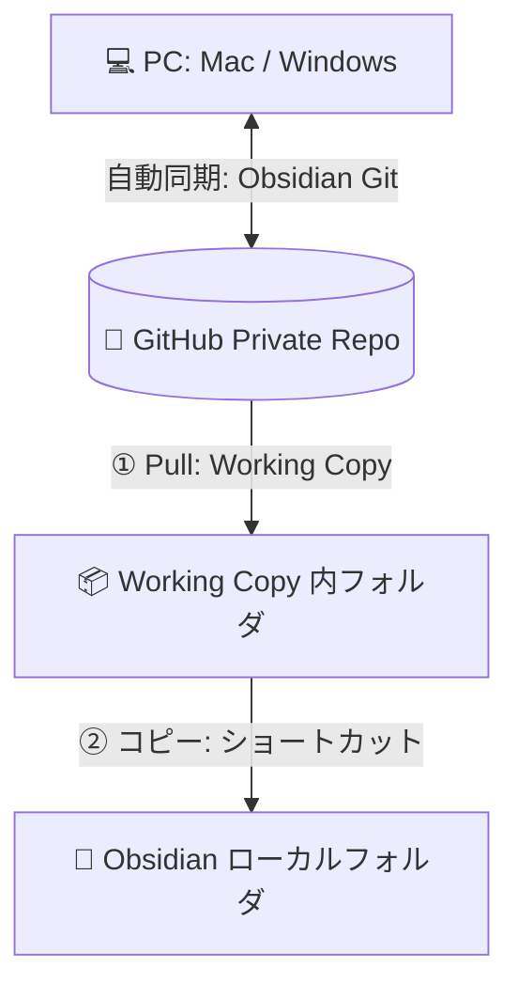

このマニュアルでは、PC（Mac）とiOSデバイス（iPhone/iPad）の間で、GitHubを経由してObsidianの保管庫（Vault）を安全かつ確実に同期する手順をまとめています。

iOS版の「Obsidian Git」プラグインは、内部のGitライブラリ（libgit2）のメモリ制限により、ファイル数や容量が大きくなるとクローンやGit操作中に**Obsidianアプリ自体がクラッシュ（強制終了）する**という深刻な問題があります。

これを回避するため、iOSネイティブで高速・安定動作するGitクライアント **「Working Copy」** と **「iOSショートカット」** を組み合わせ、起動時に物理的にファイルを最新化してコピーする、クラッシュフリーで堅牢な同期環境を構築します。

---

## 🏗️ 構成イメージ

* **PC（Mac）側**: 「Obsidian Git」プラグインを用いて、自動でコミット・プッシュ・プルを行います（完全自動同期）。
* **モバイル（iOS）側**: 「Working Copy」でGitHubから最新データを取得（Pull）し、iOSショートカットを用いて、Obsidianが認識できるローカル領域（On My iPhone > Obsidian）へフォルダごと上書きコピーして同期します。
  * **メリット1（クラッシュの完全回避）**: Obsidian Gitプラグインが抱える「メモリ不足によるアプリのクラッシュ問題」を完全に回避し、大量のファイルがあっても安定してGit操作を行えます。
  * **メリット2（同期の信頼性）**: Working Copy標準の「フォルダリンク」機能は、iOSの仕様上たまに同期が外れたり競合エラーを起こすことがありますが、ショートカットによる「物理的なフォルダ上書きコピー」にすることで、確実に最新のノートをObsidianへ反映させることができます。

---

## 🛠️ 必要なもの

1. **GitHubリポジトリ**（Private推奨）
2. **PC版 Obsidian** ＆ **Obsidian Git プラグイン**
3. **iOS版 Obsidian**
4. **iOSアプリ「Working Copy」**（無料版でPullのみ可能。Pro版でPushも可能になります）
5. **同期用iOSショートカット**
   * [Sync vault for sharing](https://www.icloud.com/shortcuts/507d0c928b4949cb9c01fcbcf74ce15f) （ユーザー作成の実績があるショートカット）

---

## 💻 PC（Mac）側の設定

PC側は「Obsidian Git」プラグインを使用して、自動同期を完全に自動化しておきます。

1. **Obsidian Git プラグインの導入**
   * Obsidianの「設定」＞「コミュニティプラグイン」から **Obsidian Git** をインストールして有効化します。
2. **自動同期の設定**
   * プラグインの設定画面で、好みに応じて以下を設定します。
     * **Vault backup interval (minutes)**: `10` など（自動コミット・プッシュの頻度）
     * **Auto pull interval (minutes)**: `10` など（自動プルの頻度）
     * **Run git pull on startup**: `オン`（起動時に自動で最新データを取得）

---

## 📱 モバイル（iPhone/iPad）側の設定

モバイル側の設定は以下の4ステップで行います。事前に空のVaultを作成しておく必要はありません。

### Step 1: GitHubリポジトリを Working Copy にクローンする
1. iOSで **Working Copy** アプリを開きます。
2. 画面右上（またはリポジトリ一覧）の **「＋」** ＞ **「Clone repository」** をタップします。
3. GitHubのリポジトリURLを入力し、GitHubのアカウント（PAT: Personal Access Token または SSH鍵）で認証してクローンします。
   * クローンが完了すると、Working Copy内にリポジトリ（例: `your-vault-name`）が作成されます。

### Step 2: 同期用ショートカットの追加と設定
実際に使用している同期用ショートカットをiOSにインポートし、自分の環境に合わせて設定します。

1. iOSデバイスで以下のリンクをタップし、ショートカットをインポートします。
   * 👉 [Sync vault for sharing (iCloudショートカットリンク)](https://www.icloud.com/shortcuts/507d0c928b4949cb9c01fcbcf74ce15f)
2. ショートカットアプリで、インポートした **「Sync vault for sharing」** の編集画面を開きます。
3. 以下の3つのアクションを設定します。

   * **①「Pull from Repository」アクション**:
     * `Repository`（リポジトリ）の部分をタップし、**Step 1でクローンした自分のリポジトリ名（例: `your-vault-name`）** を選択します。
     * `Remote` は `Default`（または `origin`）のままで問題ありません。
   * **②「ファイルをひらく（Get File）」アクション**:
     * フォルダのアイコン部分をタップし、Working Copy内の**自分のリポジトリフォルダ（例: `your-vault-name`）** を選択します。
   * **③「ファイルを保存（Save File）」アクション**:
     * 保存先として、**`On My iPhone › Obsidian`**（このiPhone内 / このiPad内 ＞ Obsidian）フォルダを指定します。
     * 詳細メニューを開き、**「上書き保存（Overwrite File）」がオン（有効）** になっていることを確認します。

4. ショートカットを一度手動で実行し、エラーなく完了することを確認します。ファイルアプリで `On My iPhone/Obsidian/` 配下にリポジトリフォルダがコピーされていれば成功です。

### Step 3: iOS版Obsidianで同期されたフォルダを開く
1. iOSで **Obsidian** アプリを開きます。
2. **「Open folder as vault（フォルダを保管庫として開く）」** を選択します。
3. `On My iPhone/Obsidian/` 内にある、ショートカットによってコピーされたフォルダ（例: `your-vault-name`）を選択します。
4. これでモバイル側のObsidianでノートが表示されます。

### Step 4: モバイル版Obsidianでの競合・エラー防止設定
PC側から同期された「Obsidian Git」プラグインの設定がモバイル側で動作してエラーを吐くのを防ぐため、以下の設定を行います。

1. iOSの **Obsidian** を開きます。
2. 「設定」＞「コミュニティプラグイン」＞ **「Obsidian Git」** の設定を開きます。
3. **「Disable on this device（このデバイスで無効化）」をオン** にします。
   * これにより、モバイル側ではObsidian Gitプラグインのバックグラウンド処理が停止し、安全になります。

---

## 🔄 オートメーション（自動化）の設定

Obsidianアプリを起動した際に、自動的に上記ショートカットが走り、常に最新の状態でノートが開くように設定します。

1. iOSの **「ショートカット」** アプリを開き、下部の **「オートメーション」** タブをタップします。
2. **「個人用オートメーションを作成」**（または右上「＋」）をタップします。
3. トリガーとして **「アプリ」** を選択します。
   * **アプリ**: `Obsidian` を選択。
   * **開いている** にチェックを入れ、**すぐに実行** を選択します。
4. アクションとして **「ショートカットを実行」** を選び、**「Sync vault for sharing」** を指定します。

これで、Obsidianアプリを立ち上げるたびにバックグラウンドで「GitHubからPull ＆ Obsidianフォルダに上書きコピー」が自動実行され、常にPC側と同期された状態で閲覧できるようになります。

---

## 🚨 トラブルシューティング

* **Q. PC側で Force Push（履歴の書き換え）を行ったらモバイルでPullエラーが出た**
  * **対策**: Working Copyは履歴の不整合（non-fast-forward）が起きるとエラーになります。この場合は、一度Working Copyアプリ内で対象リポジトリを削除し、再度GitHubからクローン（Step 1からやり直し）するのが最も早くて安全です。
* **Q. モバイル側で編集した内容もPCに送りたい（双方向同期）**
  * **対策**: 双方向同期（Push）を行うには、Working CopyのProアドオン（有料）が必要です。その上で、別途「Commit ＆ Push用のショートカット」を作成し、iOSオートメーションで「Obsidianが閉じられたとき」にそれを実行するよう設定を追加する必要があります。
